# Mend Mission Control API

Space Connect - FIAP Global Solution 2026
API de controle de missões orbitais para remoção de detritos espaciais na camada LEO.

**Pitch do projeto:** [Clique aqui para assistir ao vídeo](https://www.youtube.com/watch?v=_MjGn6lEQS0)

---

## Descrição do Projeto

A **Mend Mission Control API** é o backend da startup **Mend**, cuja missão é limpar a órbita baixa terrestre antes que o lixo espacial feche a porta do espaço para sempre.

O produto central é o **Orion, o Caçador**, uma nave que opera em órbita LEO por anos, a única no mundo que combina dois mecanismos em um só veículo:

- **Laser de ablação**: freia e sublima detritos pequenos sem contato físico, até que queimem na atmosfera.
- **Garras de captura**: agarra satélites mortos e grandes fragmentos, empurrando-os para reentrada controlada.

Radar e câmera embarcados rastreiam alvos de forma autônoma, sem depender de comandos da Terra. A nave fica em órbita após cada missão e caça o próximo alvo. Um lançamento, centenas de missões.

A API gerencia todo o ciclo operacional do Orion: catalogação e cálculo de risco de detritos, planejamento e execução de missões de remoção, registro de telemetria em tempo real e emissão de **Mend Credits**, o ativo financeiro que transforma cada remoção bem-sucedida em valor negociável, comercializado via contratos **Mend Shield** para operadores de satélites.

---

## Integrantes do Grupo

| Nome | RM |
|---|---|
| Fabiano Zague | 555524 |
| Lorran dos Santos | 558982 |
| Maria Clara | 557478 |
| Pedro Certo | 556268 |
| Vinicius Matareli | 555200 |

---

## Motivação e Conexão com o Tema Espacial

Tudo que faz o mundo funcionar passa lá em cima.

Mais de **130 milhões de fragmentos** de lixo orbital giram a **28 mil km/h** na camada LEO, a mesma utilizada por satélites de comunicação, navegação, meteorologia e Internet das Coisas. Sem sinal, o mapa não carrega, o cartão não passa, aviões e navios perdem referência. A dependência é total e invisível.

Cada colisão gera centenas de novos fragmentos, que viram novas colisões. Uma reação em cadeia que, uma vez iniciada, ninguém para. Quando isso sair de controle, tem nome: **Síndrome de Kessler**, o dia em que a porta do espaço se fecha e a chave se perde do lado de dentro.

A Mend existe para fechar essa ferida antes que ela mate o futuro. O mercado de remoção de detritos vai de 1 para **13,5 bilhões de dólares até 2035**, crescendo 25% ao ano, e a lei já obriga: sem plano de remoção, nenhum satélite é lançado.

---

## Tecnologias Utilizadas

| Tecnologia | Versão | Finalidade |
|---|---|---|
| .NET | 8.0 (LTS) | Runtime e framework principal |
| ASP.NET Core Web API | 8.0 | Exposição dos endpoints REST |
| Entity Framework Core | 9.0 | ORM e mapeamento de banco |
| Oracle EF Core Provider | 9.23.60 | Conexão com banco Oracle |
| Swashbuckle / Swagger | 6.6.2 | Documentação interativa da API |
| C# | 12 | Linguagem de programação |

---

## Estrutura de Pastas

```
MendMissionControlAPI/
├── Controllers/          # Endpoints REST (5 controllers)
│   ├── DetritosController.cs
│   ├── EquipamentosController.cs
│   ├── MendCreditsController.cs
│   ├── MissoesController.cs
│   └── TelemetriasController.cs
├── Data/
│   └── AppDbContext.cs   # Contexto EF Core + configurações Oracle
├── DTOs/                 # Data Transfer Objects (entrada e saída)
├── Enums/                # Enumerações de domínio
├── Migrations/           # Histórico de migrações EF Core
├── Models/               # Entidades do domínio (POO + herança)
│   ├── EquipamentoEspacial.cs   <- Classe abstrata base
│   ├── Satelite.cs              <- Herda de EquipamentoEspacial
│   ├── NaveLimpezaOrbital.cs    <- Herda de EquipamentoEspacial
│   ├── DetritoOrbital.cs
│   ├── MissaoRemocao.cs
│   ├── MendCredit.cs
│   └── Telemetria.cs
├── Services/             # Interfaces + implementações de serviços
├── appsettings.json
└── Program.cs
```

---

## Instruções de Execução

### Pré-requisitos

- [.NET 8 SDK](https://dotnet.microsoft.com/download/dotnet/8)
- Acesso ao banco de dados Oracle da FIAP
- Git

### 1. Clonar o repositório

```bash
git clone https://github.com/maria-kaki/MendMissionControlAPI.git
cd MendMissionControlAPI
```

### 2. Configurar a string de conexão

Abra o arquivo `appsettings.json` e substitua `RM000000` pelo seu RM e `000000` pela sua senha do banco Oracle da FIAP:

```json
{
  "ConnectionStrings": {
    "OracleConnection": "User Id=RM000000;Password=000000;Data Source=oracle.fiap.com.br:1521/ORCL;"
  },
  "Logging": {
    "LogLevel": {
      "Default": "Information",
      "Microsoft.AspNetCore": "Warning"
    }
  },
  "AllowedHosts": "*"
}
```

### 3. Aplicar as migrações

```bash
dotnet ef database update
```

### 4. Executar a aplicação

```bash
dotnet run --project MendMissionControlAPI
```

### 5. Acessar o Swagger

Após executar a aplicação, acesse o Swagger pela URL exibida no terminal. No ambiente utilizado nos testes, a API foi executada em:

```
http://localhost:5207/swagger
```

---

## Endpoints Disponíveis

| Grupo | Método | Rota | Descrição |
|---|---|---|---|
| Detritos | POST | `/api/detritos` | Catalogar novo detrito orbital |
| Detritos | GET | `/api/detritos` | Listar todos os detritos |
| Detritos | GET | `/api/detritos/{id}` | Buscar detrito por ID |
| Detritos | GET | `/api/detritos/risco/{nivel}` | Filtrar por nível de risco |
| Equipamentos | POST | `/api/equipamentos/satelites` | Registrar satélite |
| Equipamentos | POST | `/api/equipamentos/naves-limpeza` | Registrar nave de limpeza (Orion) |
| Equipamentos | GET | `/api/equipamentos` | Listar todos os equipamentos |
| Equipamentos | GET | `/api/equipamentos/{id}` | Buscar equipamento por ID |
| Missões | POST | `/api/missoes` | Planejar nova missão de remoção |
| Missões | GET | `/api/missoes` | Listar todas as missões |
| Missões | GET | `/api/missoes/{id}` | Buscar missão por ID |
| Missões | PUT | `/api/missoes/{id}/iniciar` | Iniciar missão planejada |
| Missões | PUT | `/api/missoes/{id}/concluir` | Concluir missão em andamento |
| Missões | PUT | `/api/missoes/{id}/cancelar` | Cancelar missão |
| Telemetria | POST | `/api/telemetrias` | Registrar leitura de telemetria |
| Telemetria | GET | `/api/telemetrias` | Listar todas as telemetrias |
| Telemetria | GET | `/api/telemetrias/{id}` | Buscar telemetria por ID |
| Telemetria | GET | `/api/telemetrias/nave/{naveId}` | Histórico por nave |
| Telemetria | GET | `/api/telemetrias/janela?inicio=&fim=` | Janela temporal |
| Mend Credits | POST | `/api/mendcredits/emitir` | Emitir crédito por missão concluída |
| Mend Credits | GET | `/api/mendcredits` | Listar todos os créditos |
| Mend Credits | GET | `/api/mendcredits/{id}` | Buscar crédito por ID |

---

## Diagramas do Projeto

### Fluxograma do Sistema

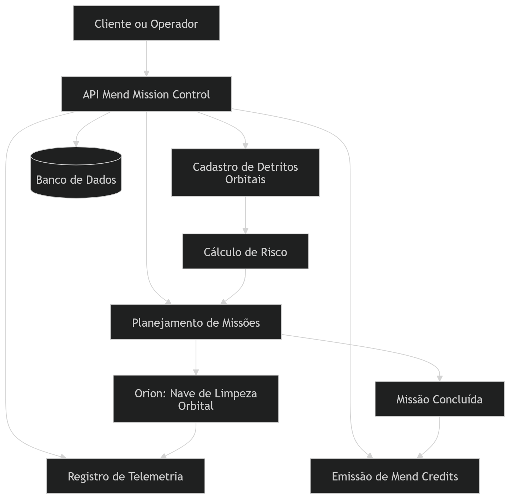

### Diagrama de Classes

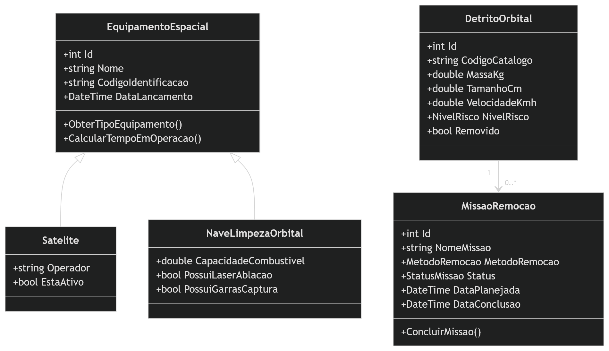

---

## Evidências de Execução

As imagens abaixo demonstram a execução da API pelo Swagger, cobrindo o ciclo principal da solução: consulta do Orion, catalogação de detrito orbital, criação e atualização de missão, registro de telemetria e emissão de Mend Credit.

### Visão geral da API no Swagger

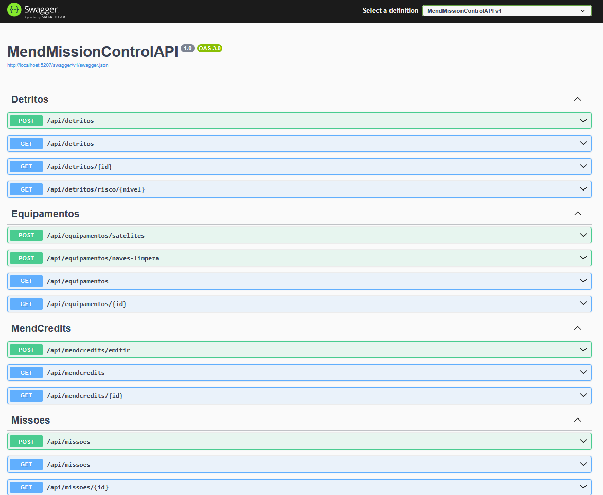

### Consulta dos equipamentos espaciais cadastrados

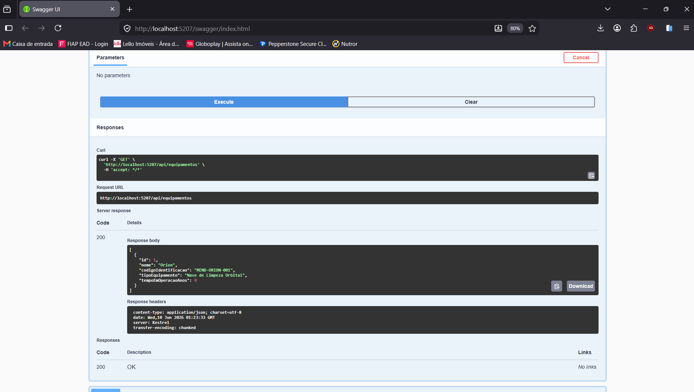

### Catalogação de detrito orbital

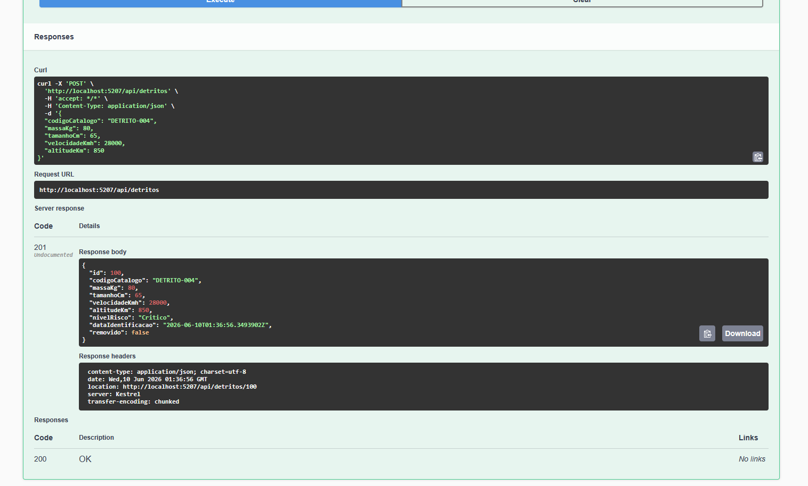

### Listagem dos detritos orbitais cadastrados

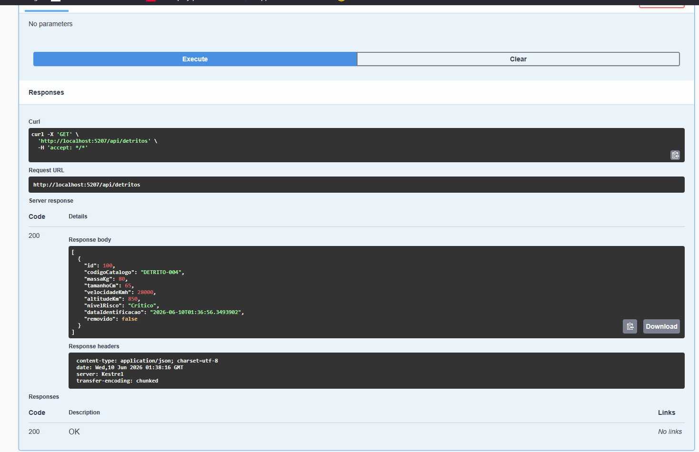

### Planejamento de missão de remoção orbital

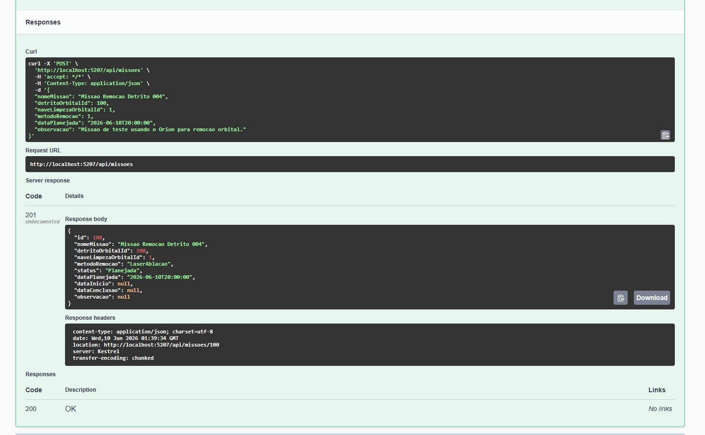

### Consulta das missões cadastradas

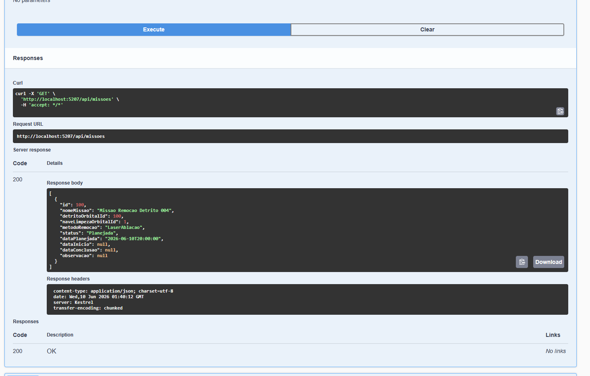

### Início da missão de remoção

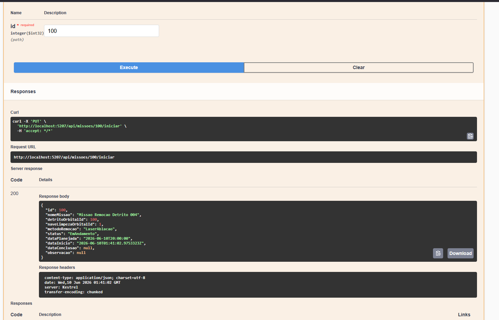

### Registro de telemetria do Orion

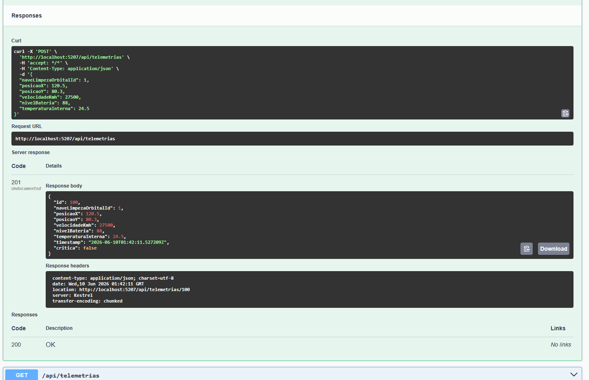

### Consulta do histórico de telemetria

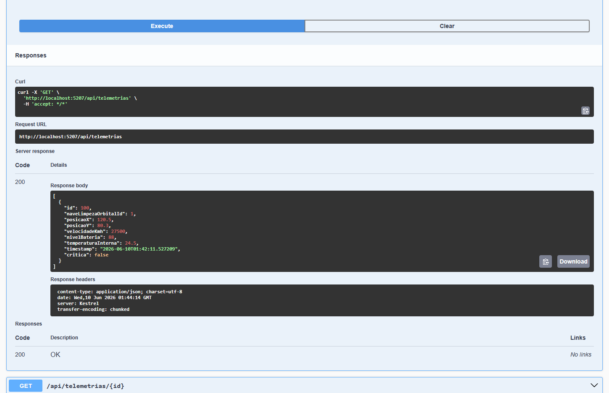

### Consulta de telemetria por janela temporal

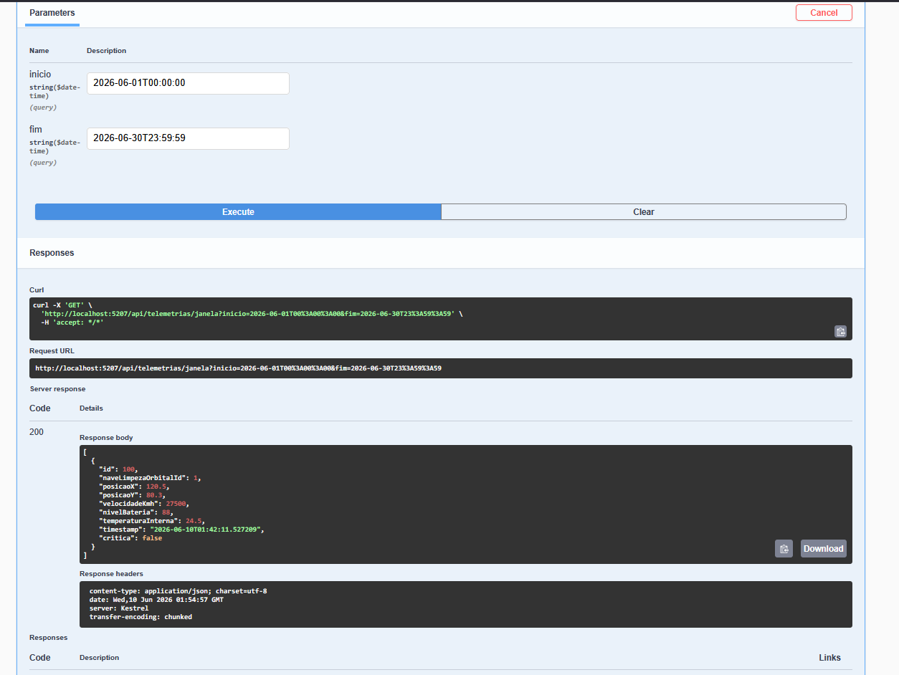

### Conclusão da missão de remoção

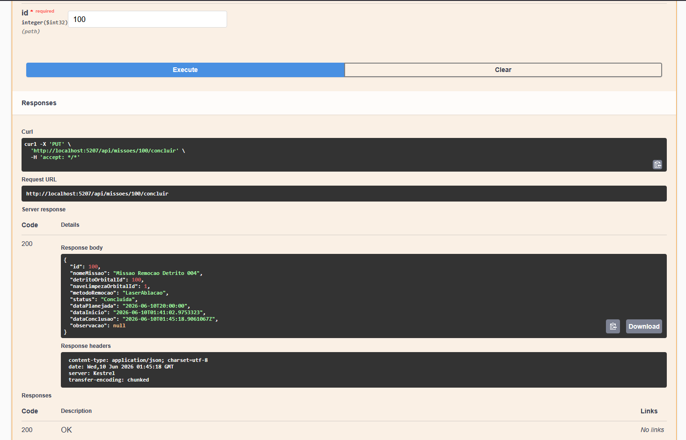

### Emissão de Mend Credit

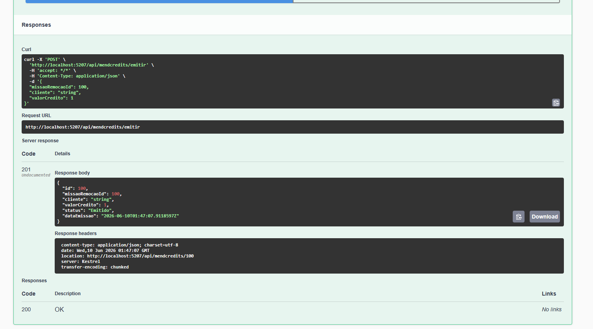

### Consulta dos Mend Credits emitidos

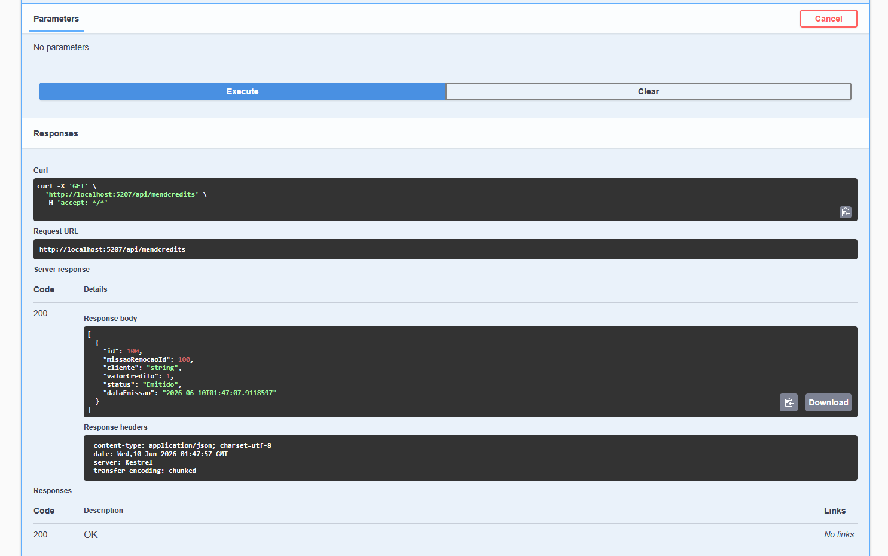

### Logs da aplicação em execução

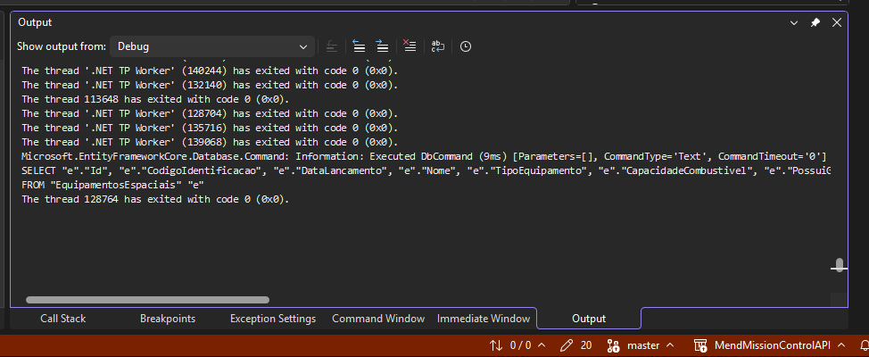

---

## Observações Técnicas

- **Banco de dados**: Oracle com mapeamento Table-Per-Hierarchy (TPH) para `EquipamentoEspacial`, `Satelite` e `NaveLimpezaOrbital`.
- **Tratamento de exceções**: todos os controllers capturam `DbUpdateException`, `InvalidOperationException`, `KeyNotFoundException` e `Exception` genérica, retornando status HTTP apropriados e logs via `ILogger`.
- **DateTime**: todos os timestamps usam `DateTime.UtcNow` para consistência em operações orbitais globais. O endpoint `/api/telemetrias/janela` permite consultas por janela temporal.
- **Regras de negócio**: missões só podem ser iniciadas se estiverem `Planejada`; só podem ser concluídas se estiverem `EmAndamento`; Mend Credits só são emitidos para missões `Concluída` e sem crédito duplicado.
